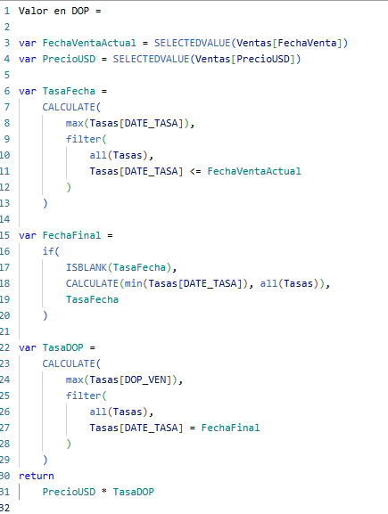

# Transformacion de Datos Sobre Divisas

La información provista posee cierta particularidad, en donde en la tabla ventas tenemos información
desde hace 10 años, mientras que la tabla con la tasa de cambio muestra información con data a partir del 2023, de manera que para cada moneda, debia de hacerse una medida en DAX donde se hiciera conversion de tasa a la fecha mas reciente que existiese.

Es decir, si la venta se realizó en el 2015, debe tomarse la tasa de cambio mas reciente del 2023. Ahora por ejemplo  si puntualmente el 21/01/2024 se realizó una venta, pero de esa fecha no existe registro de la tasa de cambio, entonces debe buscarse el registro mas cercano que sí exista.

