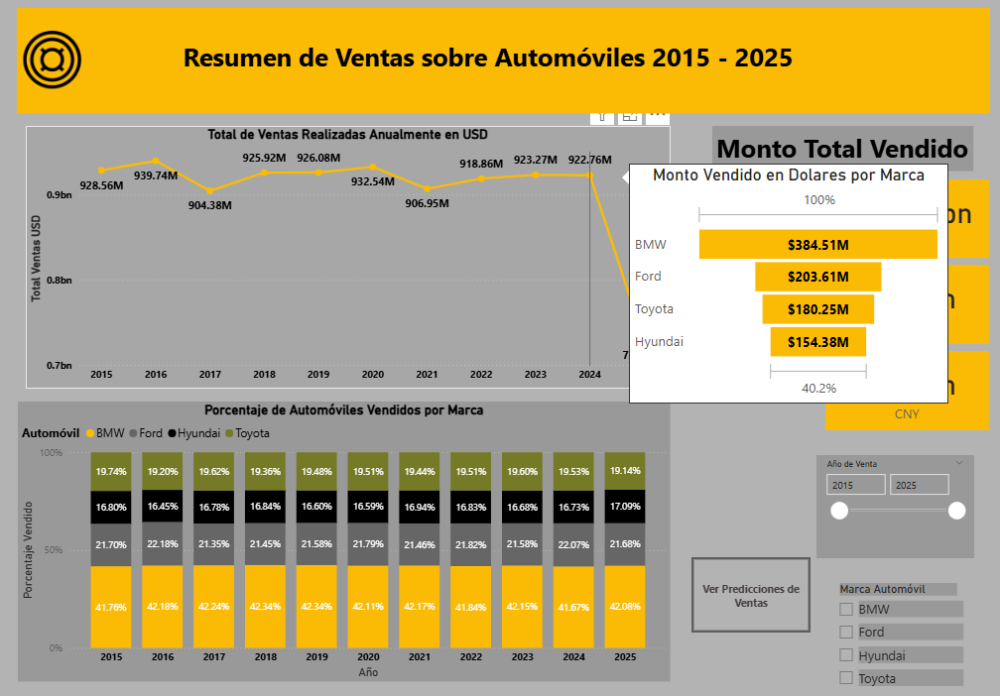
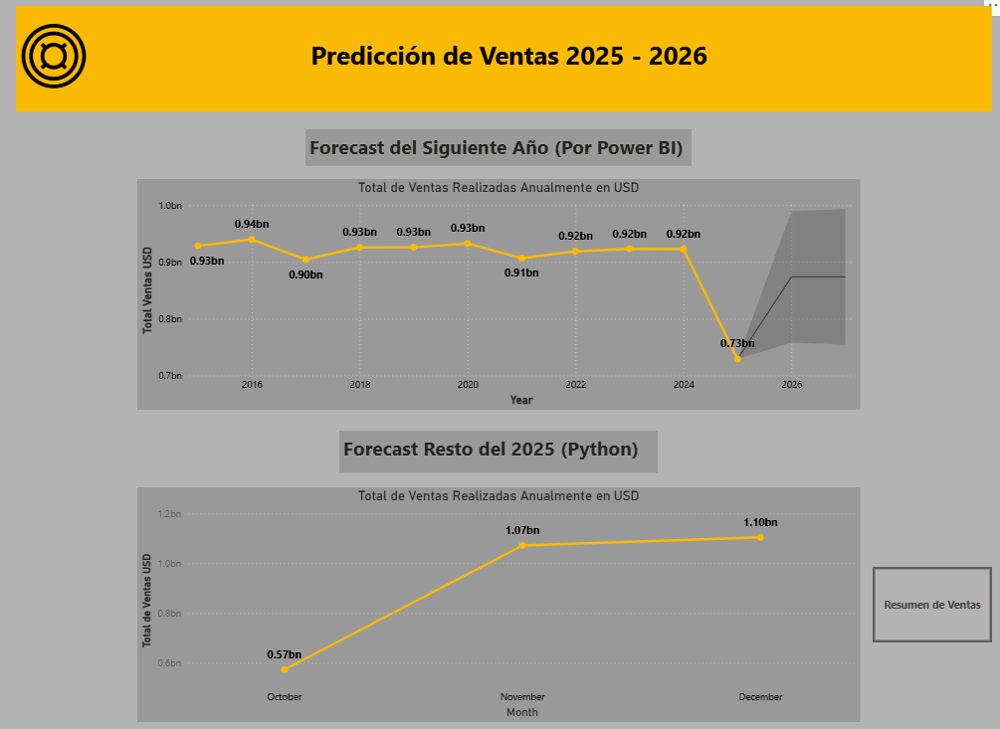

# Ventas de Vehiculos y Prediccion
Este dashboard otorga información de las ventas de vehículos de una empresa anónima a lo largo de los años.

En el dashboard podemos observar otras heramientas como tooltips utilizados para detalle puntuales de la visual

En la pagina de resumen podemos interactuar con botones que guían hacia otra pagina del reporte. En este apartado se detallan las predicciones
hechas por la herramienta interna de forecast de Power BI, mientras que el grafico inferior represta otro forecast realizado con un modelo de
python y cargado en el PBI.

Para ver mas detalles sobre el proyecto, puede descargar el archivo PBI o visitar las demas carpetas del proyecto, donde se detallan otros aspectos tecnicos de cara a la data.

# Web Sraping

Por otra parte, se montó una estructura de Web Scrpaing en Pythn para ser aprovechada posteriormente, donde se toma la tasa de cambio a la fecha.

